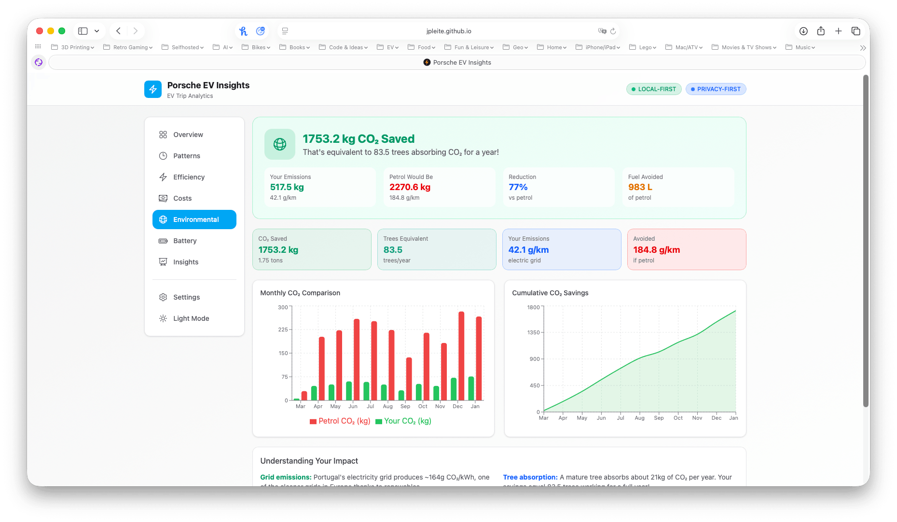

<p align="center">
  
  
  
</p>

<h1 align="center">Porsche EV Insights</h1>

<p align="center">
  <strong>Privacy-first analytics dashboard for your Porsche Taycan trip data</strong>
</p>

<p align="center">
  <a href="https://jpleite.github.io/porsche_ev_insights/">Live Demo</a> •
  <a href="#features">Features</a> •
  <a href="#getting-started">Getting Started</a> •
  <a href="#how-to-export-your-data">Export Data</a>
</p>

---

## Why Porsche EV Insights?

Porsche's My Porsche app lets you export trip data as CSV files, but analyzing that data isn't straightforward. **Porsche EV Insights** transforms your raw CSV exports into beautiful, actionable insights - all while keeping your data 100% private.

### Key Highlights

- **Your data stays yours** - Everything runs in your browser. No servers, no uploads, no tracking
- **Instant insights** - Understand your driving patterns, efficiency, and costs at a glance
- **Works offline** - Load once, use anywhere. Data persists in your browser

## Features

| Feature | Description |
|---------|-------------|
| **Overview Dashboard** | Total distance, consumption, trips, and key metrics |
| **Driving Patterns** | Analyze trips by hour, day of week, and month |
| **Efficiency Analysis** | Consumption breakdown by speed ranges and conditions |
| **Cost Calculator** | Track electricity costs with customizable rates |
| **Environmental Impact** | CO2 savings compared to combustion vehicles |
| **Battery Insights** | Charging patterns and battery usage statistics |
| **Smart Insights** | AI-generated observations about your driving habits |
| **Flexible Units** | Support for Metric, Imperial (UK), and Imperial (US) units |

## Units & Currency Settings

The app supports multiple unit systems and currencies to match your preferences:

### Unit Systems

| Setting | Metric | Imperial (UK) | Imperial (US) |
|---------|--------|---------------|---------------|
| Distance | km | mi | mi |
| Speed | km/h | mph | mph |
| Volume | L | gal (UK) | gal (US) |
| Default Currency | EUR (€) | GBP (£) | USD ($) |

### Consumption Formats

**Electric Consumption:**
- Metric: `kWh/100km` or `km/kWh`
- Imperial: `mi/kWh`, `kWh/mi`, or `kWh/100mi`

**Fuel Consumption (for comparison):**
- Metric: `L/100km` or `km/L`
- Imperial: `mpg`

### Supported Currencies

EUR, USD, GBP, CHF, CAD, AUD, JPY, CNY, SEK, NOK

All data is imported from Porsche in metric units and automatically converted based on your selected unit system.

## Screenshots

<p align="center">
  
  <br/>
  <em>Overview Dashboard - Your driving summary at a glance</em>
</p>

<p align="center">
  
  <br/>
  <em>Driving Patterns - When and how you drive</em>
</p>

<p align="center">
  
  <br/>
  <em>Efficiency Analysis - Consumption by speed and conditions</em>
</p>

<p align="center">
  
  <br/>
  <em>Environmental Impact - CO2 savings and green metrics</em>
</p>

<p align="center">
  
  <br/>
  <em>Battery Insights - Charging patterns and usage</em>
</p>

<p align="center">
  
  <br/>
  <em>Smart Insights - AI-generated observations</em>
</p>

<p align="center">
  
  <br/>
  <em>Settings - Customize your experience</em>
</p>

<p align="center">
  
  <br/>
  <em>Day Theme - Light mode for daytime use</em>
</p>

## Getting Started

### Use Online

Visit **[jpleite.github.io/porsche_ev_insights](https://jpleite.github.io/porsche_ev_insights/)** - no installation required.

### Run Locally

```bash
# Clone the repository
git clone https://github.com/jpleite/porsche_ev_insights.git
cd porsche_ev_insights

# Install dependencies
npm install

# Start development server
npm run dev
```

Open [http://localhost:5173](http://localhost:5173) in your browser.

## How to Export Your Data

1. Open **My Porsche** app on your phone
2. Go to **Vehicle details**
3. Scroll down to **All trip data**
4. Tap the **download trip icon** (top right corner)
5. Select **"Since start"** and toggle **Download complete trip history**
6. Save or send by email
7. Select **"Since charging"** and make sure **Download complete trip history** toggle is on
8. Save or send by email
9. Transfer both CSV files to your computer
10. Upload them to Porsche EV Insights

The app supports both **"Since Start"** and **"Since Charge"** CSV exports (maximum 12 months limited by Porsche Connect). Uploading both files provides richer stats and information.

## Tech Stack

| Technology | Purpose |
|------------|---------|
| [React 19](https://react.dev/) | UI framework |
| [Vite 7](https://vite.dev/) | Build tool & dev server |
| [Tailwind CSS 4](https://tailwindcss.com/) | Styling |
| [Recharts](https://recharts.org/) | Charts & visualizations |

## Privacy

**Your data never leaves your device.**

- No backend servers
- No analytics or tracking
- No cookies (except your own browser storage)
- Data stored locally in your browser's localStorage
- Works completely offline after first load

## Contributing

Contributions are welcome! Feel free to:

- Report bugs
- Suggest new features
- Submit pull requests

## License

MIT License - for personal use only.

---

<p align="center">
  Made with care for Taycan and Macan EV owners by <a href="https://github.com/jpleite">jpleite</a>
</p>
